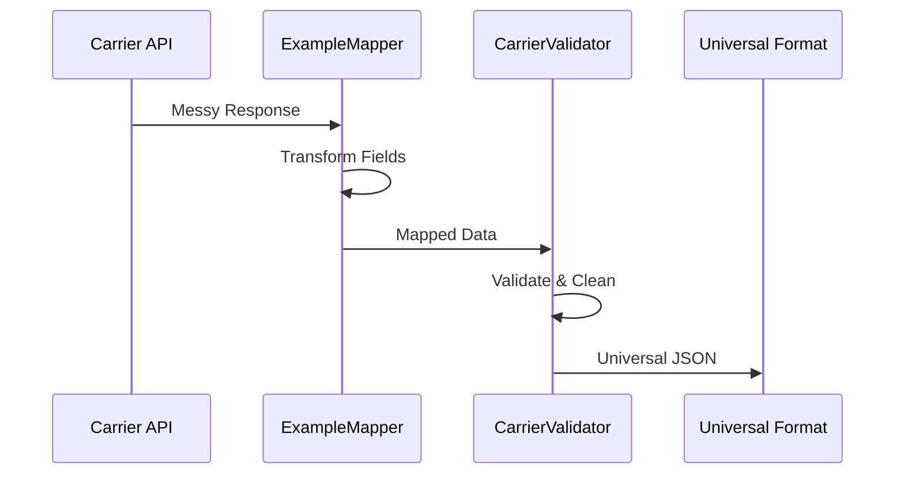
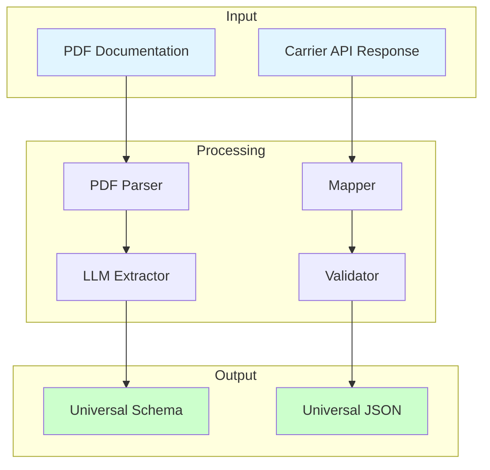

# Universal Carrier Formatter

**Proof of Concept: Transforming messy carrier responses into universal, e-commerce-ready JSON.**

## The Proof of Concept

The PoC has **two main parts.** We describe the **PDF extraction** first (the enabler), then the **conversion tool** (the runtime that turns messy carrier responses into universal JSON).

## Extracting API spec from PDFs

Most carriers lock their integration specs in massive, inconsistently formatted PDFs — the “**PDF Gatekeeper**” problem. Figuring out endpoints, field names, and rules from those docs is slow and error-prone.

**The Manual Way:** A human engineer reads the PDF, manually identifies the API endpoints, maps the field names (e.g., is it `postal_code`, `postcode`, or `zip`?), and writes the validation logic. This takes **weeks**.

**The Autonomous Way:** The **formatter** (`python -m src.formatter ...`) uses an LLM to read the PDF and extract an **API spec**: schema, field mappings, constraints, and edge cases. That spec is what you use to build the conversion pipeline (see below).

```bash
docker-compose run --rm app python -m src.formatter examples/dhl_express_api_docs.pdf -o output/schema.json
```

**Output:** JSON with `schema`, `field_mappings`, `constraints`, and `edge_cases`. That spec feeds the mapper generator (or hand-written mappers) and validators. The formatter does *not* convert carrier *responses* — it converts carrier *docs* into the spec that the conversion tool is built from. See [How to make a mapper from PDF](docs/HOW_TO_MAKE_MAPPER_FROM_PDF.md) for the full flow.

**Alternative: blueprint → schema.** If you don’t have a PDF, you can define the carrier in a YAML **blueprint** and convert it to the same `schema.json` shape. The blueprint loader reads the YAML; the converter turns it into Universal Carrier Format JSON. Same output as the formatter, so you can then generate or write mappers from it.

```bash
docker-compose run --rm app python -m src.blueprints.cli blueprints/dhl_express.yaml -o output/dhl_schema.json
```

Flow: `blueprints/carrier.yaml` → loader + converter (`src/blueprints/`) → `schema.json`. See [Blueprint vs PDF](docs/BLUEPRINT_VS_PDF.md) and [How to use blueprints](docs/HOW_TO_USE_BLUEPRINT.md).

## Converting carrier response → universal JSON

To convert a non-standard carrier response, you use a **mapper** (and validator) that was built from the `schema.json` the formatter produced. Flow:

1. **Formatter** produces `schema.json` (schema, `field_mappings`, constraints, edge cases).
2. You **build the mapper** from that spec — either generate it (`python -m src.mapper_generator_cli output/schema.json -o src/mappers/carrier_mapper.py`) or write it by hand using the spec.
3. At **runtime**, messy carrier response → that mapper + validator → universal JSON.

So the conversion step always uses a mapper that was made from (or informed by) `schema.json`.

### 1. Input: Messy, non-standard carrier response

Real-world carrier APIs return inconsistent, messy data. For example, an old DHL API might return:
```json
{
  "trk_num": "1234567890",
  "stat": "IN_TRANSIT",
  "loc": {
    "city": "London",
    "postcode": "SW1A 1AA"
  },
  "est_del": "2026-01-30"
}
```

### 2. Logic: Mapper + validator

The mapper and validator transform this data:
- Maps inconsistent field names (`trk_num` → `tracking_number`)
- Normalizes formats (`stat` → standardized status enum)
- Validates against Universal Carrier Format schema
- Handles missing fields and edge cases

### 3. Output: Universal JSON

The result is clean, standardized JSON that any e-commerce checkout can use:
```json
{
  "tracking_number": "1234567890",
  "status": "in_transit",
  "current_location": {
    "city": "London",
    "postal_code": "SW1A 1AA",
    "country": "GB"
  },
  "estimated_delivery": "2026-01-30T00:00:00Z"
}
```

**How to prove the conversion:** Run the mapper demo. It reads `examples/messy_carrier_response.json`, runs it through the mapper and validator, and prints the universal output:
```bash
docker-compose run --rm app python scripts/demo_mapper.py
```
See [Try the Demo](#try-the-demo) for details.

## What This System Does

**Universal Carrier Formatter** is a Proof of Concept that demonstrates transforming messy, non-standard carrier API responses into perfect, universal JSON that any e-commerce checkout can use.

### The Solution

This PoC showcases a complete pipeline:

1. **Document Parser** (PDF → Structured JSON) - Extracts API schemas from PDFs using LLMs
2. **Core Schema** - Universal format all carriers map to (`src/core/schema.py`)
3. **Validation Engine** - Python/Pydantic engine that validates and cleans data (`src/core/validator.py`)
4. **Mappers** - Transform carrier-specific responses to universal format (`src/mappers/`)
5. **Blueprints** - Carrier configuration and integration logic (`blueprints/`)

### How It Works


**Example Flow:**


**Basic Usage:**
```bash
# Extract schema from PDF using LLM
python -m src.formatter examples/dhl_express_api_docs.pdf --output output/schema.json

# Or in Docker
docker-compose exec app python -m src.formatter examples/dhl_express_api_docs.pdf --output output/schema.json
```

**Output:** Standardized JSON containing API endpoints, authentication methods, request/response schemas, rate limits, and metadata that can be used to automatically generate integration code.

📖 **For detailed information**, see [docs/SYSTEM_OVERVIEW.md](docs/SYSTEM_OVERVIEW.md) - includes complete workflow, use cases, error handling, and technical architecture.

## Project Structure

```
universal-carrier-formatter/
├── src/                        # Main package (all Python code)
│   ├── core/                    # Universal schema and validation
│   │   ├── schema.py            # Pydantic models (Universal Carrier Format)
│   │   └── validator.py         # Validation logic for carrier responses
│   ├── mappers/                 # Carrier-specific response mappers (built from schema.json)
│   │   ├── example_mapper.py    # Example/reference mapper
│   │   ├── example_template_mapper.py
│   │   ├── dhl_mapper.py
│   │   └── royal_mail_mapper.py
│   ├── blueprints/              # Blueprint loader, converter, processor (YAML → schema)
│   │   ├── cli.py
│   │   ├── converter.py
│   │   ├── loader.py
│   │   ├── processor.py
│   │   └── validator.py
│   ├── pdf_parser.py            # PDF parsing service
│   ├── llm_extractor.py         # LLM-based schema extraction (schema, field_mappings, constraints, edge_cases)
│   ├── extraction_pipeline.py  # PDF → formatter → schema.json pipeline
│   ├── constraint_code_generator.py   # Constraints → Pydantic validator code
│   ├── mapper_generator.py      # schema.json → mapper Python code
│   ├── mapper_generator_cli.py  # CLI for mapper generation
│   └── formatter.py             # CLI entry point (PDF → schema.json)
├── blueprints/                 # Carrier blueprints (YAML)
│   └── dhl_express.yaml
├── examples/                    # Sample PDFs and expected outputs
├── output/                      # Default output for schema.json, etc.
├── scripts/                     # Demos and utilities (e.g. demo_mapper.py)
├── tests/                       # Test files
└── docs/                        # Documentation
```

## Quick Start

**Python runs in Docker.** No local Python install required; use the Makefile and the `app` image (Python 3.11).

```bash
# One-time: build image, copy .env if needed
make setup

# Run tests
make test

# Format / lint
make format
make lint

# Parse a carrier PDF (example)
make run
# Or: docker-compose run --rm app python -m src.formatter examples/dhl_express_api_docs.pdf --output output/schema.json
```

All of `make test`, `make lint`, `make format`, `make run` use `docker-compose run --rm app`, so no need to start a long‑running container first.

### Optional: long‑running container

If you prefer a single running container and `exec` for each command:

```bash
docker-compose up -d
docker-compose exec app pytest tests/ -v
docker-compose exec app python -m src.formatter examples/dhl_express_api_docs.pdf --output output/dhl_schema.json
```

### Optional: local virtual environment

If you want to run Python locally (e.g. `python3.11 -m venv .venv` and `source .venv/bin/activate`), use `make build` only for Docker, and run `pytest`, `black`, etc. yourself. The project requires **Python 3.10+**.

## System Components



### 1. Document Parser (PDF → JSON)
Extracts structured API documentation from messy PDFs using LLMs. This is the **first part** of the system.

### 2. Core Schema
The universal format that all carriers map to. Defined in `src/core/schema.py` using Pydantic models.

### 3. Mappers
Transform carrier-specific API responses to the universal format. Each carrier has its own mapper. See `example_mapper.py` for a complete reference example, or `example_template_mapper.py` for a template.

### 4. Blueprints
YAML configuration files that define carrier-specific integration logic and endpoints.

## Proof of Concept Scenarios

The PoC demonstrates **four concrete scenarios** (aligned with [docs/POC_SCENARIOS_REVIEW.md](docs/POC_SCENARIOS_REVIEW.md)). That document provides implementation status, code locations, output formats, and gap analysis for each.

### Scenario 1: Automated Schema Mapping

**Problem:** Carrier PDF says "Sender Address Line 1 (required, max 50 chars)" but API uses `s_addr_1`. Manual mapping takes hours.

**PoC Solution:** Parser automatically generates mapping file in minutes:
```json
{
  "universal_field": "sender_address_line_1",
  "carrier_field": "s_addr_1",
  "required": true,
  "max_length": 50,
  "type": "string"
}
```

### Scenario 2: Constraint Extraction

**Problem:** Hidden business rules like "Weight must be in grams for Germany, kilograms for UK" are easy to miss.

**PoC Solution:** Parser extracts constraints and generates Pydantic validation logic automatically:
```python
@validator('weight')
def validate_weight(cls, v, values):
    if values.get('destination_country') == 'DE':
        return v * 1000 if values.get('unit') == 'kg' else v
    elif values.get('destination_country') == 'GB':
        return v / 1000 if values.get('unit') == 'g' else v
    return v
```

### Scenario 3: Edge Case Discovery

**Problem:** 200-page shipping guide contains route-specific requirements. Human engineers miss these until parcels get stuck.

**PoC Solution:** Parser scans entire document and flags all edge cases (customs, surcharges, restrictions, route-specific rules):
```json
{
  "edge_cases": [
    {
      "type": "customs_requirement",
      "route": "EU → Canary Islands",
      "requirement": "Customs declaration required",
      "documentation": "Section 4.2.3, page 87"
    },
    {
      "type": "surcharge",
      "condition": "remote_area",
      "applies_to": ["postcodes starting with 'IV', 'KW', 'PA'"],
      "surcharge_amount": "£2.50"
    }
  ]
}
```

### Scenario 4: Complete Transformation (E-Commerce Integration)

**Problem:** E-commerce checkout needs consistent data, but carriers return different formats.

**PoC Solution:** Complete transformation pipeline:
```
Messy DHL Response → Mapper → Validator → Universal JSON → Checkout Ready
```

**Example:**
```json
// Input (messy)
{"trk_num": "1234567890", "stat": "IN_TRANSIT", "loc": {"city": "London"}}

// Output (universal)
{
  "tracking_number": "1234567890",
  "status": "in_transit",
  "current_location": {
    "city": "London",
    "postal_code": "SW1A 1AA",
    "country": "GB"
  }
}
```

📖 **PoC scenarios:** [docs/POC_SCENARIOS_REVIEW.md](docs/POC_SCENARIOS_REVIEW.md) — implementation status, code locations, output structures.  
📖 **System overview:** [docs/SYSTEM_OVERVIEW.md](docs/SYSTEM_OVERVIEW.md) — workflow, use cases, architecture.

## Universal Carrier Format

The project uses a standardized JSON schema to represent carrier API documentation. See `examples/expected_output.json` for a complete example.

The schema includes:
- **Endpoints**: API paths, methods, request/response schemas
- **Authentication**: API keys, OAuth, Bearer tokens, etc.
- **Parameters**: Query strings, path params, headers, body schemas
- **Rate Limits**: Request limits and periods
- **Metadata**: Carrier name, base URL, version, documentation links

Models are defined using Pydantic (similar to Laravel Eloquent models with validation).

## Testing

Tests use `pytest` (similar to PHPUnit in PHP):

```bash
# Run tests in tests/ directory (recommended)
make docker-test-tests

# Run with coverage
make docker-test-coverage

# Validate schema models (quick check)
docker-compose exec app python scripts/validate_schema.py
```

See [docs/TESTING.md](docs/TESTING.md) for complete testing guide.

## Try the Demo

**This is how you prove we convert non-standard carrier response to universal JSON.** The demo uses the real file `examples/messy_carrier_response.json`, runs it through the mapper and validator, and prints input → output so you can see the transformation.

```bash
# Run the mapper demo (Docker; no local Python required)
docker-compose run --rm app python scripts/demo_mapper.py

# Or with local Python
python scripts/demo_mapper.py
```

The script prints:
1. **Input** — the raw messy response from `examples/messy_carrier_response.json` (e.g. `trk_num`, `stat`, `loc`, `est_del`)
2. **Transformation** — field-by-field mapping (e.g. `trk_num` → `tracking_number`)
3. **Output** — the universal JSON ready for e-commerce checkout

## Onboarding New Carriers

To onboard a new carrier:

1. **Extract Schema from PDF** (if PDF available):
   ```bash
   python -m src.formatter carrier_docs.pdf --output output/carrier_schema.json
   ```

2. **Generate Mapper Code** (automated):
   ```bash
   python -m src.mapper_generator_cli output/carrier_schema.json --output src/mappers/carrier_mapper.py
   ```

3. **Or Create Mapper Manually** - Transform carrier responses to universal format:
   ```python
   # src/mappers/new_carrier.py
   from src.core.schema import UniversalCarrierFormat
   
   class NewCarrierMapper:
       def map(self, carrier_response):
           # Transform messy response to universal format
           return UniversalCarrierFormat(...)
   ```

3. **Create Blueprint** - Define carrier configuration:
   ```yaml
   # blueprints/new_carrier.yaml
   carrier:
     name: "New Carrier"
     base_url: "https://api.newcarrier.com"
   ```

4. **Test & Validate**:
   ```python
   mapper = NewCarrierMapper()
   universal_format = mapper.map(messy_response)
   validator = CarrierValidator()
   validated = validator.validate(universal_format.dict())
   ```

📖 **See [docs/ONBOARDING.md](docs/ONBOARDING.md) for complete onboarding guide.**  
📖 **See [docs/HOW_TO_MAKE_MAPPER_FROM_PDF.md](docs/HOW_TO_MAKE_MAPPER_FROM_PDF.md) for PDF → Mapper workflow.**

## Development Pipeline

See [docs/POC_SCENARIOS_REVIEW.md](docs/POC_SCENARIOS_REVIEW.md) for PoC scenario implementation status, code locations, and output structures.

See [docs/SYSTEM_OVERVIEW.md](docs/SYSTEM_OVERVIEW.md) for complete system documentation.

See [docs/ONBOARDING.md](docs/ONBOARDING.md) for guide on onboarding new carriers.

See [docs/DEVELOPMENT_PIPELINE.md](docs/DEVELOPMENT_PIPELINE.md) for detailed guide on:
- PHP → Python concepts mapping
- Testing workflow
- Project structure
- Common commands

See [docs/DOCKER.md](docs/DOCKER.md) for Docker development guide.

See [docs/LARAVEL_COMPARISON.md](docs/LARAVEL_COMPARISON.md) for Laravel → Python comparisons.

## Pre-commit Checks

A pre-commit Git hook runs format + lint before each commit. The project keeps a **tracked** hook in `scripts/pre-commit.hook` so everyone uses the same Docker setup as the Makefile.

**Install the hook (one-time):**
```bash
cp scripts/pre-commit.hook .git/hooks/pre-commit && chmod +x .git/hooks/pre-commit
```

The hook uses `docker-compose run --rm app` (same as `make test` / `make lint`), so you do **not** need `docker-compose up -d`. Older hooks used `docker-compose exec app` only when the app container was already running; otherwise they ran flake8/black **locally**, which could fail or differ from CI if your host tools didn’t match the project. The new hook always uses Docker when available and never depends on a running container.

**Manual check (same as hook):**
```bash
make pre-commit
```

**Notes:**
- Formatting (black/isort) is non-blocking; flake8 is blocking.
- Flake8 options come from `setup.cfg` (e.g. E501/W503/E203 ignored when using Black).

## Next Steps

1. ✅ **PDF Parser** - Complete (extracts text from PDFs)
2. ✅ **Mapper Demo** - Complete (Example mapper with working transformation)
3. ✅ **LLM Integration** - Complete (LangChain setup with schema extraction)
4. ✅ **CLI Interface** - Complete (`src/formatter.py` entry point)
5. ✅ **Extraction Pipeline** - Complete (PDF → LLM → Validation → Output)
6. ✅ **Blueprint System** - Complete (loader, validator, converter, processor)
7. ✅ **Mapper Generation** - Complete (auto-generate mapper code from schemas)
8. ⏳ **More Mappers** - Next: Implement additional carrier mappers
9. ⏳ **Production Ready** - Next: Error handling, logging, monitoring
