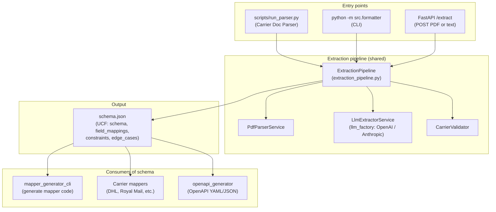
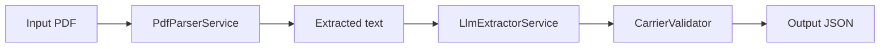

# Architecture and component diagram

This document describes how the main entry points (run_parser, formatter, API) share the same extraction pipeline and schema, and how mappers consume the output.

## Component overview

## Flow

1. **Entry points**  
   - **run_parser:** One-file script; `python scripts/run_parser.py <pdf> [-o output.json]` — the “Carrier Doc Parser” from the brief.  
   - **formatter:** Full CLI; `python -m src.formatter <pdf> -o output/schema.json` with options (--provider, --dry-run, --dump-pdf-text, etc.).  
   - **API:** `POST /extract` with a PDF file (multipart) or pre-extracted text (JSON).  

2. **Shared pipeline**  
   All three use `ExtractionPipeline`: PDF → `PdfParserService` (text) → `LlmExtractorService` (LLM via `llm_factory`: OpenAI or Anthropic) → `CarrierValidator` → UCF JSON. The same schema contract and keys (`schema`, `field_mappings`, `constraints`, `edge_cases`, `schema_version`, `generator_version`) are produced.

3. **Output**  
   `schema.json` conforms to the Universal Carrier Format (see `src/core/schema.py`, `docs/schema_contract_meta_schema.json`).

4. **Consumers**  
   - **Mapper generator:** Reads `schema.json`, generates mapper code.  
   - **Mappers:** Convert carrier-specific responses to UCF using the schema (see `docs/ADDING_A_CARRIER.md`).  
   - **OpenAPI generator:** Builds OpenAPI/Swagger from `schema.json`.

## Pipeline detail (BRIEF)

The same linear flow as in [BRIEF_SCORE_AND_IMPROVEMENTS.md](BRIEF_SCORE_AND_IMPROVEMENTS.md):

## Related docs

- [HOW_TO_MAKE_MAPPER_FROM_PDF.md](HOW_TO_MAKE_MAPPER_FROM_PDF.md) — From PDF to schema to mapper.
- [ADDING_A_CARRIER.md](ADDING_A_CARRIER.md) — Registry and mapper layout.
- [EXTRACTION_REPRODUCIBILITY.md](EXTRACTION_REPRODUCIBILITY.md) — Reproducibility and metadata.
