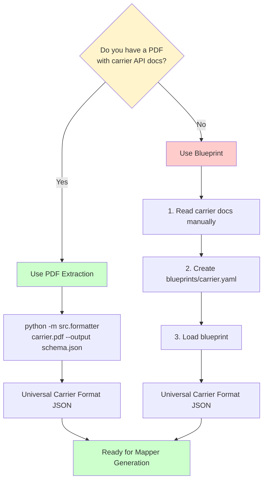

# Blueprint vs PDF Extraction: When to Use What

## Two Paths to the Same Goal

Both blueprints and PDF extraction produce the same output: **Universal Carrier Format JSON**. They're just different ways to get there.

## Path 1: PDF Extraction (Automated) ✅ Preferred

**When:** You have a PDF with carrier API documentation

**Workflow:**
```
PDF Document
    ↓
PDF Parser (extracts text)
    ↓
Save extracted text (always; output/<stem>_extracted_text.txt)
    ↓
LLM Extractor (extracts schema)
    ↓
Universal Carrier Format JSON
```

**Command:**
```bash
python -m src.formatter examples/carrier_docs.pdf --output output/carrier_schema.json
```

**Pros:**
- ✅ Automated - LLM does the work
- ✅ Fast - Minutes instead of hours
- ✅ Consistent - Same extraction logic for all carriers
- ✅ Handles complex PDFs with tables, multiple pages

**Cons:**
- ❌ Requires PDF document
- ❌ LLM costs money (API calls)
- ❌ May need manual review/correction

## Path 2: Blueprint (Manual) 📝 Fallback

**When:** You DON'T have a PDF, or PDF extraction failed/unreliable

**Workflow:**
```
Carrier Documentation (web, docs, etc.)
    ↓
Human reads and writes YAML
    ↓
Blueprint YAML file
    ↓
Blueprint Loader (converts to Universal Carrier Format)
    ↓
Universal Carrier Format JSON
```

**Steps:**
1. Read carrier's API documentation (website, docs, etc.)
2. Manually create `blueprints/carrier.yaml`
3. Load blueprint → Convert to Universal Carrier Format

**Pros:**
- ✅ No PDF needed
- ✅ Human control - you decide what goes in
- ✅ Free - no LLM costs
- ✅ Can be more accurate if you know the API well

**Cons:**
- ❌ Manual work - takes time
- ❌ Human error possible
- ❌ Slower than automated extraction

## Decision Tree



## Real-World Examples

### Example 1: DHL Express
- **Situation:** We have `examples/dhl_express_api_docs.pdf`
- **Approach:** PDF Extraction ✅
- **Command:** `python -m src.formatter examples/dhl_express_api_docs.pdf --output output/dhl_schema.json`

### Example 2: Small Regional Courier
- **Situation:** No PDF, only web documentation
- **Approach:** Blueprint 📝
- **Steps:**
  1. Read their API docs on website
  2. Create `blueprints/regional_courier.yaml`
  3. Load it to get Universal Carrier Format

### Example 3: PDF Extraction Failed
- **Situation:** PDF exists but LLM extraction gave poor results
- **Approach:** Hybrid
  1. Use PDF extraction as starting point
  2. Review and fix the output
  3. Or: Create blueprint manually based on PDF content

## Can You Use Both?

**Yes!** You can use both approaches:

1. **Extract from PDF first** → Get initial schema
2. **Review and fix** → Create blueprint from corrected schema
3. **Use blueprint as source of truth** → More reliable than raw extraction

Or:

1. **Create blueprint manually** → Based on carrier docs
2. **Later get PDF** → Extract from PDF
3. **Compare both** → Validate they match

## Current Status

**What's Built:**
- ✅ PDF Extraction pipeline (Path 1) - **WORKING**
- ✅ Blueprint example file (`dhl_express.yaml`) - **EXISTS**
- ❌ Blueprint loader/processor (Path 2) - **NOT BUILT YET**

**What's Missing:**
- Blueprint loader that reads YAML
- Blueprint converter that converts YAML → Universal Carrier Format
- Blueprint validator

## Summary

| Scenario | Use This |
|----------|----------|
| Have PDF | PDF Extraction (automated) |
| No PDF | Blueprint (manual) |
| PDF extraction failed | Blueprint (manual fallback) |
| Want human control | Blueprint (manual) |
| Want speed | PDF Extraction (automated) |

**Bottom line:** Blueprint is the **manual fallback** when you don't have a PDF or when PDF extraction isn't reliable.
