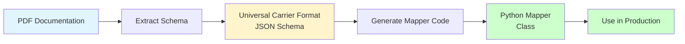

# How to Make a Mapper from PDF

## Complete Workflow: PDF → Mapper Code



This guide shows the complete end-to-end process of creating a mapper from a carrier's PDF documentation.

## Step-by-Step Process

### Step 1: Extract Schema from PDF

Use the PDF extraction pipeline to convert the PDF into Universal Carrier Format JSON:

```bash
# Extract schema from PDF
python -m src.formatter examples/carrier_docs.pdf --output output/carrier_schema.json

# Or in Docker
docker-compose exec app python -m src.formatter examples/carrier_docs.pdf --output output/carrier_schema.json
```

**What this does:**
1. Parses PDF → extracts text, tables, metadata
2. **Saves extracted text** → `output/<pdf_stem>_extracted_text.txt` (always, before LLM)
3. Sends text to LLM → extracts API schema
4. Validates schema → ensures it matches Universal Carrier Format
5. Saves JSON → `output/carrier_schema.json`

**Output:** `output/carrier_schema.json` - Universal Carrier Format schema

### Step 2: Generate Mapper Code

Use the mapper generator to create Python mapper code from the schema:

```bash
# Generate mapper from schema
python -m src.mapper_generator_cli output/carrier_schema.json --output src/mappers/carrier_mapper.py

# Or in Docker
docker-compose exec app python -m src.mapper_generator_cli output/carrier_schema.json --output src/mappers/carrier_mapper.py
```

**What this does:**
1. Loads Universal Carrier Format schema
2. Sends schema to LLM → generates mapper code
3. Extracts and cleans code → removes markdown formatting
4. Saves Python file → `src/mappers/carrier_mapper.py`

**Output:** `src/mappers/carrier_mapper.py` - Complete mapper class ready to use

## Complete Example

Here's a complete example using the DHL Express PDF:

```bash
# Step 1: Extract schema from PDF
python -m src.formatter examples/dhl_express_api_docs.pdf --output output/dhl_schema.json

# Step 2: Generate mapper code
python -m src.mapper_generator_cli output/dhl_schema.json --output src/mappers/dhl_express_mapper.py

# Step 3: Use the mapper
python -c "
from src.mappers.dhl_express_mapper import DhlExpressMapper
mapper = DhlExpressMapper()
result = mapper.map_tracking_response({'trackingNumber': '1234567890', 'status': 'in_transit'})
print(result)
"
```

## Alternative: Using Blueprints

If you don't have a PDF, you can use a blueprint instead:

```bash
# Step 1: Create blueprint manually (blueprints/carrier.yaml)

# Step 2: Convert blueprint to schema
python -m src.blueprints.cli blueprints/carrier.yaml --output output/carrier_schema.json

# Step 3: Generate mapper from schema (same as above)
python -m src.mapper_generator_cli output/carrier_schema.json --output src/mappers/carrier_mapper.py
```

## What the Generated Mapper Includes

The generated mapper will have:

1. **Field Mappings** - Maps carrier field names to universal format
   ```python
   FIELD_MAPPING = {
       "carrier_field": "universal_field",
       ...
   }
   ```

2. **Status Mappings** - Normalizes status values
   ```python
   STATUS_MAPPING = {
       "CARRIER_STATUS": "universal_status",
       ...
   }
   ```

3. **Main Mapping Method** - `map_tracking_response()`
   - Transforms messy carrier response → universal format
   - Handles missing fields, date parsing, etc.

4. **Helper Methods** - Date formatting, country derivation, etc.

5. **Schema Mapping** - `map_carrier_schema()`
   - Maps carrier schema → UniversalCarrierFormat

## Manual Adjustments

After generation, you may need to:

1. **Review field mappings** - Ensure all fields are correctly mapped
2. **Add custom logic** - Carrier-specific transformations
3. **Handle edge cases** - Special cases not in the schema
4. **Test thoroughly** - Test with real carrier responses

## Troubleshooting

### PDF extraction fails
- Check PDF is readable (not scanned image)
- Try `--no-tables` flag if tables cause issues
- Check LLM API key is set in `.env`

### Mapper generation fails
- Verify schema JSON is valid
- Check LLM API key is set
- Try a different LLM model with `--llm-model`

### Generated mapper has errors
- Review generated code
- Check imports are correct
- Ensure field mappings match actual carrier responses

## Quick Reference

```bash
# Complete workflow in one go
PDF → Schema → Mapper

# Commands:
python -m src.formatter <pdf> --output <schema.json>
python -m src.mapper_generator_cli <schema.json> --output <mapper.py>

# Or with blueprints:
python -m src.blueprints.cli <blueprint.yaml> --output <schema.json>
python -m src.mapper_generator_cli <schema.json> --output <mapper.py>
```

## See Also

- [HOW_TO_RUN.md](HOW_TO_RUN.md) - Detailed running instructions
- [ONBOARDING.md](ONBOARDING.md) - Complete onboarding guide
- [LLM_EXTRACTION_FLOW.md](LLM_EXTRACTION_FLOW.md) - How LLM extraction works
