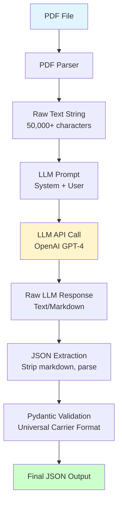

# LLM Extraction Flow: From PDF Text to JSON

## Overview

This document explains how we pass extracted PDF text to the LLM and convert its response into structured JSON.

**Data preservation:** We keep as much data extracted from the document by the LLM as possible. We do not deduplicate or trim endpoints, edge_cases, field_mappings, or constraints. Schema models use `extra="allow"` so any extra keys the LLM returns (e.g. on endpoints, responses, auth) are preserved in the output. Rate-limit entries are kept even when numeric fields need a fallback; we only normalize field names (e.g. `status` → `status_code`, `limit` → `requests`) for validation.

## The Complete Flow



## Step-by-Step Breakdown

### Step 1: Extract Text from PDF

**Input:** PDF file path
**Output:** Plain text string

```python
# In extraction_pipeline.py
pdf_text = self.pdf_parser.extract_text(pdf_path)
# Result: "DHL Express API Documentation\n\nChapter 1: Introduction\n..."
```

**Example extracted text:**
```
DHL Express API Documentation
Version 2.33

GET /api/v1/track/{trackingNumber}
Retrieve tracking information for a shipment.

Request Parameters:
- trackingNumber (path, required): The shipment tracking number
- format (query, optional): Response format (json/xml)

Response:
200 OK
{
  "ShipmentNumber": "1234567890",
  "Status": "IN_TRANSIT",
  "CurrentLocation": {
    "City": "London",
    "Country": "GB"
  }
}
```

### Step 2: Create LLM Prompt

**Code:** `llm_extractor.py` lines 154-201

We create a **two-part prompt**:

#### System Prompt (Instructions to LLM)
```
You are an expert API documentation parser. Your job is to extract structured 
API information from carrier documentation and convert it to a standardized 
Universal Carrier Format JSON schema.

Your task:
1. Identify all API endpoints (paths, HTTP methods)
2. Extract request parameters (query, path, headers, body)
3. Extract response schemas (status codes, body structure)
4. Identify authentication methods
5. Extract rate limits
6. Extract field mappings (carrier field names → universal field names)
7. Identify business rules and constraints

Output ONLY valid JSON matching the Universal Carrier Format schema. 
Do not include any explanatory text, only the JSON object.
```

#### User Prompt (The Actual PDF Text)
```
Extract the API schema from this carrier documentation:

{pdf_text}

Return a JSON object matching the Universal Carrier Format schema with:
- name: Carrier name
- base_url: Base API URL
- version: API version
- description: Brief description
- endpoints: Array of endpoint objects with path, method, request, responses
- authentication: Array of authentication methods
- rate_limits: Array of rate limit objects

For each endpoint, extract:
- path: API path (e.g., "/api/v1/track")
- method: HTTP method (GET, POST, etc.)
- summary: Brief description
- request: Parameters and body schema
- responses: Array of possible responses with status codes

Return ONLY the JSON, no markdown formatting or explanations.
```

### Step 3: Send to LLM

**Code:** `llm_extractor.py` lines 118-125

```python
# Create prompt chain
prompt = self._create_extraction_prompt()
chain = prompt | self.llm

# Send to LLM (LangChain handles the API call)
response = chain.invoke({"pdf_text": pdf_text})

# Response is a LangChain AIMessage object
content = response.content  # This is the raw text response
```

**What actually happens:**
- LangChain sends HTTP POST to OpenAI API
- Request body includes system prompt + user prompt (with PDF text)
- OpenAI processes and returns text response

### Step 4: LLM Raw Response

**What the LLM returns:** Raw text string (not JSON yet!)

**Common formats LLM might return:**

#### Format 1: Plain JSON (best case)
```json
{
  "name": "DHL Express",
  "base_url": "https://api.dhl.com",
  "version": "v1",
  "endpoints": [...]
}
```

#### Format 2: JSON wrapped in markdown code block (common)
````
```json
{
  "name": "DHL Express",
  "base_url": "https://api.dhl.com",
  "version": "v1",
  "endpoints": [...]
}
```
````

#### Format 3: JSON with explanatory text (needs cleaning)
```
Here's the extracted schema:

{
  "name": "DHL Express",
  "base_url": "https://api.dhl.com",
  ...
}

Note: Some endpoints may require authentication.
```

### Step 5: Extract JSON from Response

**Code:** `llm_extractor.py` lines 203-248

We use `_extract_json_from_response()` to handle all these cases:

```python
def _extract_json_from_response(self, response_content: str) -> Dict[str, Any]:
    content = response_content.strip()
    
    # Case 1: JSON in markdown code block ```json ... ```
    if "```json" in content:
        start = content.find("```json") + 7
        end = content.find("```", start)
        content = content[start:end].strip()
    
    # Case 2: Generic code block ```
    elif "```" in content:
        start = content.find("```") + 3
        end = content.find("```", start)
        content = content[start:end].strip()
        if content.startswith("json"):
            content = content[4:].strip()
    
    # Case 3: Find JSON object boundaries { ... }
    if "{" in content and "}" in content:
        start = content.find("{")
        end = content.rfind("}") + 1
        content = content[start:end]
    
    # Parse JSON
    return json.loads(content)
```

**Result:** Clean Python dictionary (parsed JSON)

### Step 6: Validate Against Schema

**Code:** `llm_extractor.py` line 135

```python
# Validate against Universal Carrier Format schema
validated_schema = self.validator.validate(json_data)
```

**What happens:**
- Pydantic checks all required fields exist
- Validates data types (strings, numbers, enums)
- Validates nested structures (endpoints, parameters)
- Converts to `UniversalCarrierFormat` object

**If validation fails:**
- Raises `ValidationError` with detailed error messages
- We catch it and raise `ValueError` with helpful message

### Step 7: Final Output

**Code:** `extraction_pipeline.py` lines 142-152

The final JSON file contains:

```json
{
  "schema": {
    "name": "DHL Express",
    "base_url": "https://api.dhl.com",
    "version": "v1",
    "endpoints": [
      {
        "path": "/api/v1/track/{trackingNumber}",
        "method": "GET",
        "summary": "Track shipment",
        "request": {
          "parameters": [
            {
              "name": "trackingNumber",
              "type": "string",
              "location": "path",
              "required": true
            }
          ]
        },
        "responses": [
          {
            "status_code": 200,
            "body_schema": {
              "type": "object",
              "properties": {
                "ShipmentNumber": {"type": "string"},
                "Status": {"type": "string"}
              }
            }
          }
        ]
      }
    ],
    "authentication": [
      {
        "type": "api_key",
        "location": "header",
        "parameter_name": "X-API-Key"
      }
    ],
    "rate_limits": [
      {
        "requests": 100,
        "period": "1 minute"
      }
    ]
  },
  "field_mappings": [
    {
      "carrier_field": "ShipmentNumber",
      "universal_field": "tracking_number",
      "description": "Tracking number"
    },
    {
      "carrier_field": "Status",
      "universal_field": "status",
      "description": "Shipment status"
    }
  ],
  "constraints": [
    {
      "field": "weight",
      "rule": "Must be in grams for Germany",
      "type": "unit_conversion",
      "condition": "destination_country == 'DE'"
    }
  ]
}
```

## Example: Real Flow

### Input PDF Text (excerpt)
```
DHL Express API v2.33

Endpoint: GET /tracking/v1/shipments/{trackingNumber}

Description: Retrieve tracking information for a shipment.

Parameters:
- trackingNumber (path, required): DHL tracking number (10 digits)
- format (query, optional): Response format, default: json

Authentication: API key in X-API-Key header

Response 200:
{
  "ShipmentNumber": "1234567890",
  "Status": "IN_TRANSIT",
  "CurrentLocation": {
    "City": "London",
    "CountryCode": "GB"
  },
  "EstimatedDelivery": "2026-01-30"
}

Rate Limit: 100 requests per minute
```

### LLM Prompt Sent
```
System: [Instructions to extract structured API info...]

User: Extract the API schema from this carrier documentation:

DHL Express API v2.33
Endpoint: GET /tracking/v1/shipments/{trackingNumber}
...
```

### LLM Response (raw)
````
```json
{
  "name": "DHL Express",
  "base_url": "https://api.dhl.com",
  "version": "v2.33",
  "description": "DHL Express API for tracking shipments",
  "endpoints": [
    {
      "path": "/tracking/v1/shipments/{trackingNumber}",
      "method": "GET",
      "summary": "Retrieve tracking information",
      "request": {
        "parameters": [
          {
            "name": "trackingNumber",
            "type": "string",
            "location": "path",
            "required": true,
            "description": "DHL tracking number (10 digits)"
          },
          {
            "name": "format",
            "type": "string",
            "location": "query",
            "required": false,
            "description": "Response format, default: json"
          }
        ]
      },
      "responses": [
        {
          "status_code": 200,
          "body_schema": {
            "type": "object",
            "properties": {
              "ShipmentNumber": {"type": "string"},
              "Status": {"type": "string"},
              "CurrentLocation": {
                "type": "object",
                "properties": {
                  "City": {"type": "string"},
                  "CountryCode": {"type": "string"}
                }
              },
              "EstimatedDelivery": {"type": "string", "format": "date"}
            }
          }
        }
      ]
    }
  ],
  "authentication": [
    {
      "type": "api_key",
      "location": "header",
      "parameter_name": "X-API-Key"
    }
  ],
  "rate_limits": [
    {
      "requests": 100,
      "period": "1 minute"
    }
  ]
}
```
````

### After JSON Extraction
```python
json_data = {
  "name": "DHL Express",
  "base_url": "https://api.dhl.com",
  "version": "v2.33",
  "endpoints": [...],
  # ... rest of the data
}
```

### After Pydantic Validation
```python
validated_schema = UniversalCarrierFormat(
  name="DHL Express",
  base_url="https://api.dhl.com/",  # Pydantic normalizes URLs
  version="v2.33",
  endpoints=[...],  # Validated Endpoint objects
  # ...
)
```

### Final Output File
```json
{
  "schema": {
    "name": "DHL Express",
    "base_url": "https://api.dhl.com/",
    "version": "v2.33",
    "endpoints": [...],
    "authentication": [...],
    "rate_limits": [...]
  },
  "field_mappings": [...],
  "constraints": [...]
}
```

## Key Points

1. **Input:** Plain text string from PDF (can be 10,000+ characters)
2. **Prompt:** Two-part (system instructions + user prompt with PDF text)
3. **LLM Response:** Raw text (often wrapped in markdown code blocks)
4. **JSON Extraction:** Strips markdown, finds JSON boundaries, parses
5. **Validation:** Pydantic ensures it matches Universal Carrier Format schema
6. **Output:** Validated JSON file ready for mapper generation

## Error Handling

- **Invalid JSON:** Raises `ValueError` with parsing error details
- **Schema mismatch:** Raises `ValueError` with Pydantic validation errors
- **API errors:** LangChain handles retries, we catch and re-raise as `ValueError`

## See Also

- [Extraction reproducibility](EXTRACTION_REPRODUCIBILITY.md) - Determinism, extraction_metadata (LLM config, prompt_versions), golden tests
- `src/llm_extractor.py` - LLM extraction logic
- `src/extraction_pipeline.py` - Complete pipeline orchestration
- `src/core/schema.py` - Universal Carrier Format schema definition
- `src/core/validator.py` - Pydantic validation logic
