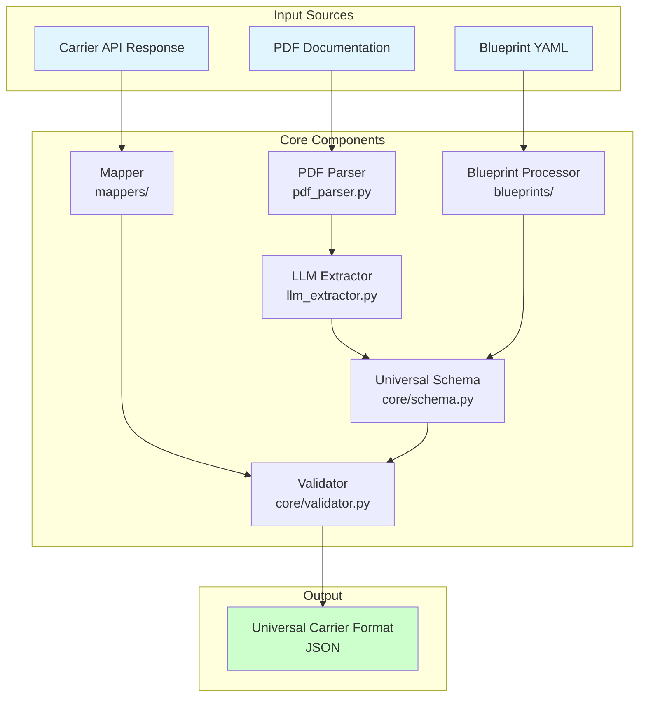
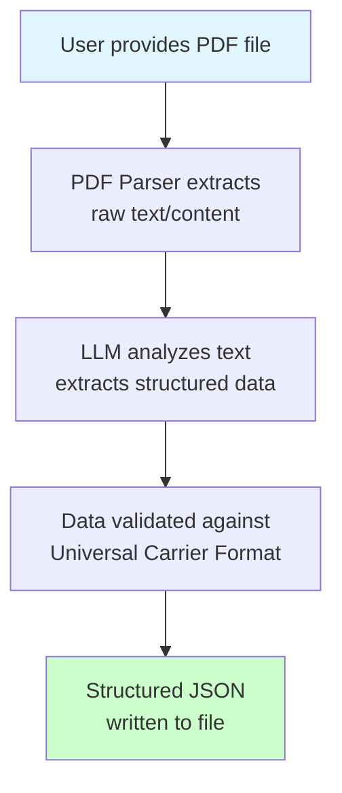
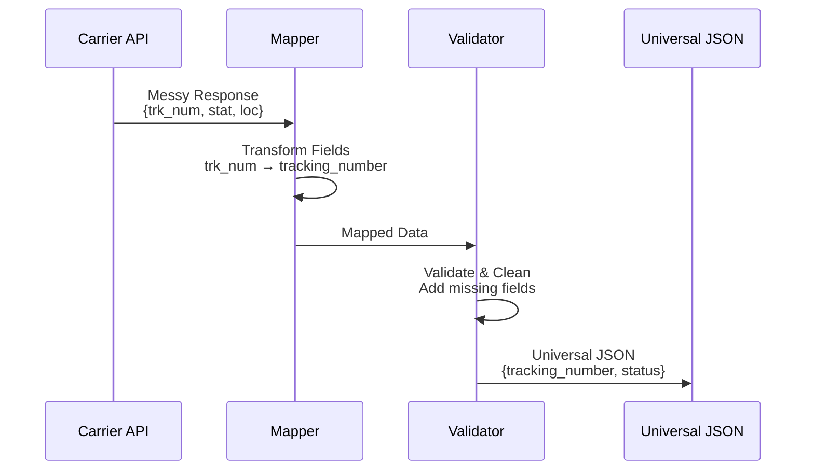
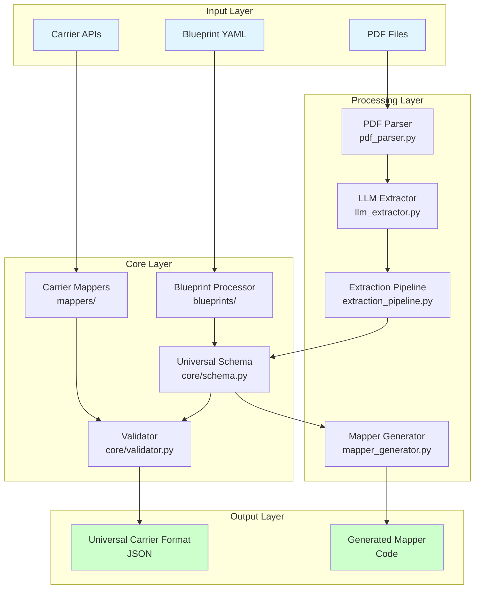

# System Overview

## Proof of Concept: Three-Part Transformation

This PoC demonstrates transforming messy carrier responses into universal, e-commerce-ready JSON through three core components:

### 1. Input: Messy, Non-Standard Carrier Response

Real-world carrier APIs return inconsistent, messy data structures. For example, an old DHL API might return:

```json
{
  "trk_num": "1234567890",
  "stat": "IN_TRANSIT",
  "loc": {
    "city": "London",
    "postcode": "SW1A 1AA"
  },
  "est_del": "2026-01-30"
}
```

**Problems:**
- Inconsistent field names (`trk_num` vs `tracking_number`)
- Non-standard status values (`IN_TRANSIT` vs `in_transit`)
- Missing required fields (country code)
- Inconsistent date formats
- Nested structures vary by carrier

### 2. Logic: Python/Pydantic Validation & Cleaning Engine

Our validation engine (`core/validator.py`) transforms this messy data:

- **Validates** against Universal Carrier Format schema
- **Maps** inconsistent field names (`trk_num` → `tracking_number`)
- **Normalizes** data formats (`stat` → standardized status enum)
- **Cleans** and validates nested structures
- **Handles** missing fields and edge cases
- **Transforms** via carrier-specific mappers (`mappers/example_mapper.py`, etc.)

### 3. Output: Perfect Universal JSON

The result is a clean, standardized JSON that any e-commerce checkout can use:

```json
{
  "tracking_number": "1234567890",
  "status": "in_transit",
  "current_location": {
    "city": "London",
    "postal_code": "SW1A 1AA",
    "country": "GB"
  },
  "estimated_delivery": "2026-01-30T00:00:00Z"
}
```

**Benefits:**
- Consistent structure across all carriers
- Standardized field names
- Validated data types
- Complete required fields
- Ready for e-commerce integration

### System Architecture



The PoC consists of four main components:

1. **Document Parser** (PDF → JSON) - Extracts structured API docs from messy PDFs (`src/pdf_parser.py`)
2. **Core Schema** - Universal format all carriers map to (`core/schema.py`, `core/validator.py`)
3. **Mappers** - Transform carrier-specific responses to universal format (`mappers/`)
4. **Blueprints** - Carrier configuration and integration logic (`blueprints/`)

---

## User Interaction

### Command-Line Interface (CLI)

Users interact with the system through a simple command-line tool:

```bash
# Basic usage
python -m src.formatter --input carrier_docs.pdf --output formatted.json

# With Docker (recommended)
docker-compose exec app python -m src.formatter \
    --input examples/sample.pdf \
    --output output.json

# Using Makefile shortcut
make run
```

### Command Options

```bash
python -m src.formatter \
    --input <pdf_file>          # Required: Path to carrier PDF documentation
    --output <json_file>        # Optional: Output file path (default: output.json)
    --llm-model <model>         # Optional: LLM model to use (default: gpt-4)
    --verbose                   # Optional: Show detailed processing logs
```

**Laravel Equivalent**: Like `php artisan carrier:format input.pdf --output=output.json`

---

## System Workflow

### Step-by-Step Process



### Detailed Pipeline

1. **Input Validation**
   - Check PDF file exists and is readable
   - Validate file format
   - Extract basic metadata (page count, file size)

2. **PDF Text Extraction**
   - Extract text from all pages
   - Extract tables (important for API docs)
   - Extract metadata (title, author, etc.)
   - Handle multi-page documents

3. **LLM Processing**
   - Send extracted text to LLM (via LangChain)
   - Use structured prompts to identify:
     - API endpoints (paths, methods)
     - Authentication methods
     - Request/response schemas
     - Parameters (query, path, headers, body)
     - Rate limits
     - Base URLs and versions

4. **Schema Validation**
   - Validate extracted data against Pydantic models
   - Ensure all required fields are present
   - Type-check all values
   - Provide clear error messages if validation fails

5. **Output Generation**
   - Format as JSON matching Universal Carrier Format
   - Write to specified output file
   - Provide success/error feedback to user

---

## Input Format

### What Users Provide

- **Input**: A PDF file containing carrier API documentation
  - Can be text-based or scanned (scanned PDFs may need OCR - future enhancement)
  - Typically contains endpoint descriptions, authentication info, examples
  - May have inconsistent formatting, tables, diagrams

**Example Input**: `examples/sample_carrier.pdf`

---

## Output Format

### Universal Carrier Format JSON

The system outputs a standardized JSON schema that includes:

- **Metadata**: Carrier name, base URL, API version, description
- **Endpoints**: All API endpoints with:
  - Path and HTTP method
  - Request parameters (query, path, headers, body)
  - Response schemas (status codes, content types, body structure)
  - Authentication requirements
  - Tags/categories
- **Authentication**: Supported auth methods (API keys, OAuth, Bearer tokens)
- **Rate Limits**: Request limits and time periods
- **Documentation Links**: References to original docs

**Example Output**: See `examples/expected_output.json`

### Output Structure

```json
{
  "name": "Carrier Name",
  "base_url": "https://api.carrier.com",
  "version": "v1",
  "description": "...",
  "endpoints": [
    {
      "path": "/api/v1/track/{id}",
      "method": "GET",
      "summary": "...",
      "request": { ... },
      "responses": [ ... ]
    }
  ],
  "authentication": [ ... ],
  "rate_limits": [ ... ]
}
```

---

## PoC Demonstration: Complete Transformation Flow



### Example: Old DHL API Response → Universal JSON

**Step 1: Input (Messy DHL Response)**
```json
{
  "trk_num": "1234567890",
  "stat": "IN_TRANSIT",
  "loc": {
    "city": "London",
    "postcode": "SW1A 1AA"
  },
  "est_del": "2026-01-30"
}
```

**Step 2: Mapper Transformation**
```python
# mappers/example_mapper.py (or dhl_express_mapper.py)
mapper = DhlMapper()
mapped_data = mapper.map(dhl_response)
# Transforms: trk_num → tracking_number, stat → status, etc.
```

**Step 3: Validation & Cleaning**
```python
# core/validator.py
validator = CarrierValidator()
cleaned_data = validator.validate(mapped_data)
# Validates types, adds missing fields, normalizes formats
```

**Step 4: Output (Universal JSON)**
```json
{
  "tracking_number": "1234567890",
  "status": "in_transit",
  "current_location": {
    "city": "London",
    "postal_code": "SW1A 1AA",
    "country": "GB"
  },
  "estimated_delivery": "2026-01-30T00:00:00Z"
}
```

**Result:** Any e-commerce checkout can use this JSON directly, regardless of which carrier it came from.

## Use Case: Autonomous Onboarding

The Parser's job is to turn unstructured human language into structured machine-readable intent.

### 1. Automated Schema Mapping

Instead of a human mapping "Sender Address Line 1" to the carrier's specific JSON field `s_addr_1`, the parser identifies the requirement from the documentation and generates a mapping file instantly.

**Example:**
```
PDF says: "Sender Address Line 1 (required, max 50 chars)"
Parser generates: {
  "field": "sender_address_line_1",
  "carrier_field": "s_addr_1",
  "required": true,
  "max_length": 50,
  "type": "string"
}
```

### 2. Constraint Extraction

Carrier docs are full of "hidden" rules. The Parser identifies these business rules and turns them into Pydantic validation logic (Python code) automatically.

**Examples:**
- "Weight must be in grams if shipping to Germany, but kilograms for the UK."
- "Telephone numbers must not include the + prefix for this specific endpoint."
- "Postal codes must match format: [A-Z]{2}[0-9]{4} for this region."

**Parser Output:**
```python
@validator('weight')
def validate_weight(cls, v, values):
    if values.get('destination_country') == 'DE':
        # Must be in grams
        return v * 1000 if values.get('unit') == 'kg' else v
    elif values.get('destination_country') == 'GB':
        # Must be in kilograms
        return v / 1000 if values.get('unit') == 'g' else v
    return v
```

### 3. Edge Case Discovery

Logistics is 90% edge cases (hazardous goods, remote area surcharges, customs for the Canary Islands). A Parser can scan a 200-page "Global Shipping Guide" and flag every specific requirement for a particular route, which a human engineer might miss until a parcel gets stuck at a border.

**Parser Output:**
```json
{
  "edge_cases": [
    {
      "type": "customs_requirement",
      "route": "EU → Canary Islands",
      "requirement": "Customs declaration required",
      "documentation": "Section 4.2.3, page 87"
    },
    {
      "type": "surcharge",
      "condition": "remote_area",
      "applies_to": ["postcodes starting with 'IV', 'KW', 'PA'"],
      "surcharge_amount": "£2.50"
    }
  ]
}
```

## Why It Is Useful (The ROI)

### Speed to Market

If a 3PL (like Huboo) wants to add a new carrier in Italy, they don't have to wait for a developer's sprint cycle. The Parser "ingests" the Italian carrier and the system is **80% ready in minutes**.

**Before:** 2-3 weeks of manual work
**After:** Minutes of automated parsing + 1-2 days of review/testing

### Consistency

Human engineers interpret docs differently. An AI parser applied to a "Universal Schema" ensures that every carrier integration looks and acts exactly the same way inside your system.

**Benefit:** No more "this carrier works differently" surprises. All integrations follow the same patterns.

### Maintenance

When a carrier updates their API and sends a new "v2.1 Docs" PDF, the parser can "diff" the new document against the old one and automatically update the integration code.

**Workflow:**
```
1. Receive new PDF (v2.1)
2. Parse and extract schema
3. Compare with existing v2.0 schema
4. Generate diff report
5. Auto-update integration code
6. Flag breaking changes for review
```

## PoC Scenarios

The Proof of Concept demonstrates three core capabilities through concrete scenarios:

### Scenario 1: Automated Schema Mapping

**Problem:** A carrier PDF says "Sender Address Line 1 (required, max 50 chars)" but the API uses `s_addr_1`. Manual mapping takes hours.

**PoC Demonstration:**
```
Input: PDF documentation
  "Sender Address Line 1 (required, max 50 chars)"
  "Tracking Number (alphanumeric, 10-20 chars)"

Output: Automated mapping file
{
  "mappings": [
    {
      "universal_field": "sender_address_line_1",
      "carrier_field": "s_addr_1",
      "required": true,
      "max_length": 50,
      "type": "string"
    },
    {
      "universal_field": "tracking_number",
      "carrier_field": "trk_num",
      "required": true,
      "pattern": "^[A-Z0-9]{10,20}$",
      "type": "string"
    }
  ]
}

Result: Mapper automatically generated in minutes
```

### Scenario 2: Constraint Extraction

**Problem:** Carrier docs contain hidden business rules like "Weight must be in grams for Germany, kilograms for UK." These are easy to miss and cause integration failures.

**PoC Demonstration:**
```
Input: PDF documentation
  "Weight must be in grams if shipping to Germany, but kilograms for the UK."
  "Telephone numbers must not include the + prefix for this endpoint."

Output: Pydantic validation logic (auto-generated)
@validator('weight')
def validate_weight(cls, v, values):
    if values.get('destination_country') == 'DE':
        # Must be in grams
        return v * 1000 if values.get('unit') == 'kg' else v
    elif values.get('destination_country') == 'GB':
        # Must be in kilograms
        return v / 1000 if values.get('unit') == 'g' else v
    return v

@validator('phone_number')
def validate_phone(cls, v):
    # Remove + prefix if present
    return v.lstrip('+')

Result: Validation logic automatically extracted and implemented
```

### Scenario 3: Edge Case Discovery

**Problem:** A 200-page "Global Shipping Guide" contains route-specific requirements (customs for Canary Islands, remote area surcharges). Human engineers miss these until parcels get stuck.

**PoC Demonstration:**
```
Input: 200-page PDF "Global Shipping Guide"
  Scans entire document for edge cases

Output: Comprehensive edge case report
{
  "edge_cases": [
    {
      "type": "customs_requirement",
      "route": "EU → Canary Islands",
      "requirement": "Customs declaration required",
      "documentation": "Section 4.2.3, page 87",
      "impact": "Required field: customs_declaration"
    },
    {
      "type": "surcharge",
      "condition": "remote_area",
      "applies_to": ["postcodes starting with 'IV', 'KW', 'PA'"],
      "surcharge_amount": "£2.50",
      "documentation": "Section 7.1.2, page 142",
      "impact": "Additional fee calculation required"
    },
    {
      "type": "restriction",
      "item_type": "hazardous_goods",
      "restriction": "Not allowed for air freight",
      "documentation": "Section 9.3.1, page 201",
      "impact": "Validation rule needed"
    }
  ]
}

Result: All edge cases flagged before integration, preventing production issues
```

### Scenario 4: Complete Transformation Flow (E-Commerce Integration)

**Problem:** E-commerce checkout needs consistent data format, but each carrier returns different structures.

**PoC Demonstration:**
```
Input: Messy DHL API response
{
  "trk_num": "1234567890",
  "stat": "IN_TRANSIT",
  "loc": {
    "city": "London",
    "postcode": "SW1A 1AA"
  },
  "est_del": "2026-01-30"
}

Step 1: Mapper transforms (using auto-generated mapping)
  trk_num → tracking_number
  stat → status (IN_TRANSIT → in_transit)
  loc → current_location
  est_del → estimated_delivery

Step 2: Validator cleans and validates
  - Adds missing country code (derived from postcode)
  - Normalizes date format
  - Validates all fields against schema

Output: Perfect Universal JSON
{
  "tracking_number": "1234567890",
  "status": "in_transit",
  "current_location": {
    "city": "London",
    "postal_code": "SW1A 1AA",
    "country": "GB"
  },
  "estimated_delivery": "2026-01-30T00:00:00Z"
}

Result: E-commerce checkout uses this JSON directly, regardless of carrier
```

---

## Technical Architecture



### Components

1. **Document Parser** (`src/pdf_parser.py`)
   - Extracts text and tables from PDFs
   - Handles errors and edge cases
   - Provides metadata extraction
   - **This is the first part of the system**

2. **Core Schema** (`core/schema.py`, `core/validator.py`)
   - Pydantic models defining Universal Carrier Format
   - Validation and type checking
   - JSON serialization
   - **The "Universal" part - all carriers map to this**

3. **Mappers** (`mappers/`)
   - Transform carrier-specific responses to universal format
   - Example: `example_mapper.py` (complete reference), `example_template_mapper.py` (template)
   - Handles field name mapping (e.g., `s_addr_1` → `sender_address_line_1`)

4. **Blueprints** (`blueprints/`)
   - YAML configuration files for carrier-specific logic
   - Example: `dhl_express.yaml`
   - Defines endpoints, authentication, rate limits

5. **LLM Integration** ✅ Complete
   - LangChain setup for LLM calls
   - Structured prompt templates for:
     - Schema extraction
     - Constraint extraction (business rules → Pydantic validators)
     - Edge case discovery
   - Response parsing and validation

6. **CLI Interface** ✅ Complete
   - Command-line entry point
   - Argument parsing
   - User feedback and error handling

7. **Extraction Pipeline** ✅ Complete
   - Orchestrates PDF → LLM → Validation → Output
   - Schema mapping generation
   - Constraint extraction
   - Edge case discovery
   - Error handling and logging

---

## Configuration

### Environment Variables

Users need to configure LLM API keys:

```bash
# .env file
OPENAI_API_KEY=sk-...
# Or for other providers:
ANTHROPIC_API_KEY=...
```

**Laravel Equivalent**: Like `config/services.php` for API keys

---

## Error Handling

### Common Errors Users May Encounter

1. **File Not Found**
   ```
   Error: PDF file not found: carrier_docs.pdf
   ```

2. **Invalid PDF Format**
   ```
   Error: Unable to parse PDF. File may be corrupted or encrypted.
   ```

3. **LLM API Error**
   ```
   Error: Failed to connect to LLM API. Check your API key.
   ```

4. **Validation Error**
   ```
   Error: Extracted data doesn't match schema. Missing required field: 'base_url'
   ```

5. **Permission Error**
   ```
   Error: Cannot write to output file. Check file permissions.
   ```

---

## Success Criteria

A successful run should:
- ✅ Process PDF without errors
- ✅ Extract all major API endpoints
- ✅ Identify authentication methods
- ✅ Capture request/response schemas
- ✅ Output valid Universal Carrier Format JSON
- ✅ Provide clear feedback to user

---

## Future Enhancements

- **Batch Processing**: Process multiple PDFs at once
- **OCR Support**: Handle scanned PDFs
- **Interactive Mode**: Ask user for clarification when extraction is ambiguous
- **Web Interface**: GUI for non-technical users
- **API Mode**: REST API endpoint for programmatic access
- **Validation Reports**: Detailed reports on extraction quality
- **Incremental Updates**: Update existing JSON when carrier docs change

---

## Comparison to Laravel Patterns

| Laravel Concept | This Project |
|----------------|--------------|
| `php artisan` command | `python -m src.formatter` |
| `Command::class` | Click CLI decorators |
| `Service::class` | Service classes (`PdfParserService`) |
| `Model::class` | Pydantic models |
| `Validator::make()` | Pydantic validation |
| `Log::info()` | Python `logging` module |
| `config('services.openai')` | `.env` file + `os.getenv()` |

---

## Next Steps for Implementation

1. ✅ **PDF Parser** - Complete (extracts text from PDFs)
2. ⏳ **LLM Integration** - Next: Set up LangChain and design prompts
3. ⏳ **CLI Interface** - Next: Create `src/formatter.py` entry point
4. ⏳ **Extraction Pipeline** - Next: Combine PDF parser + LLM + validation
5. ⏳ **Error Handling** - Next: Comprehensive error messages and recovery
